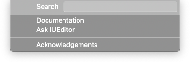

메뉴 Menu
==========================

IUEditor 메뉴 바 Menu Bar 에 대한 설명입니다.
------------------------------------------------------

아이유에디터 IUEditor
----------------------------

* ``About IUEditor`` : 사용자 IUEditor의 버젼 정보를 보여줍니다.
* ``Preference`` : 사용자 IUEditor의 :doc:`환경설정 Preference<009_00_preference>` 창을 엽니다.

파일 File
----------------------------

* ``New Project`` : 새 프로젝트 만들기 창을 띄웁니다.
* ``Open`` : Finder에서 오픈할 프로젝트를 찾습니다.
* ``Open Recent`` : 최근 사용한 IU프로젝트 파일을 오픈합니다.
* ``Save`` : 현재 프로젝트 파일을 저장합니다.
* ``Save As`` : 현재 프로젝트 파일을 다른 이름으로 저장합니다.
* ``Close`` : 현재 프로젝트를 닫습니다.

프로젝트 Project
----------------------------

* ``Build`` : 프로젝트를 브라우저로 빌드합니다. 상단툴바의 빌드실행버튼과 동일한 기능입니다.
* ``Build Clean`` : 빌드 데이터를 지웁니다. 빌드에 오류가 있을 때 문제를 해결할 수 있습니다.
* ``Stop`` : 빌드를 멈춥니다.
* ``Project Setting`` : :doc:`프로젝트 셋팅 Project Setting<004_01_panel_project_setting>` 패널을 띄웁니다.
* ``Project Code`` : :ref:`Project Code<Page_Custom_Code>` 패널을 보여줍니다.
* ``Refresh Page`` : 페이지를 새로고침 합니다. 캔버스에 오류가 있을 때 문제를 해결할 수 있습니다.

뷰 View
----------------------------

* ``Show Tab Bar`` : 탭바를 보여줍니다.
* ``Show All Tabs`` : 전제 탭을 보여줍니다.
* ``ZoomOut`` : 캔버스를 확대합니다.
* ``ZoomIn`` : 캔버스를 축소합니다.
* ``Outline`` : 위젯 외곽선을 보여줍니다.
* ``Ruler`` : 스테이지에 룰러 요소를 보여줍니다.
* ``Guide`` : 설정해 놓은 가이드라인을 보여줍니다.
* ``Tracing`` : 이미지 트레이싱 기능을 on/off 합니다.
* ``Enter Full Screen`` : 전체화면으로 전환합니다.

창 Window
----------------------------

.. image:: resource_new/window.png

* ``Event`` : :doc:`이벤트 패널 Event Panel<004_03_panel_event>` 을 보여줍니다.
* ``Resource`` : :doc:`리소스 패널 Resource Panel<004_02_panel_resource>` 을 보여줍니다.
* ``Memo`` : :doc:`메모 패널 Memo Panel<004_04_panel_memo>` 을 보여줍니다.
* ``Manage Custom Widgets`` : :doc:`커스텀 위젯 관리 패널 Manage Custom Widgets Panel<004_05_panel_management_widget>` 을 보여줍니다.
* ``Log`` : 로그패널을 보여줍니다.

지원 Help
----------------------------

* ``Search`` : IUEditor의 기능을 검색합니다.
* ``Documentation`` : IUEditor 메뉴얼 사이트를 방문합니다.
* ``Ask IUEditor`` : 프로그램에 대한 문의를 할 수 있는 웹페이지로 이동합니다.
* ``Acknowledgements`` : 프로그램에 사용된 API에 대한 정보를 보여줍니다.
