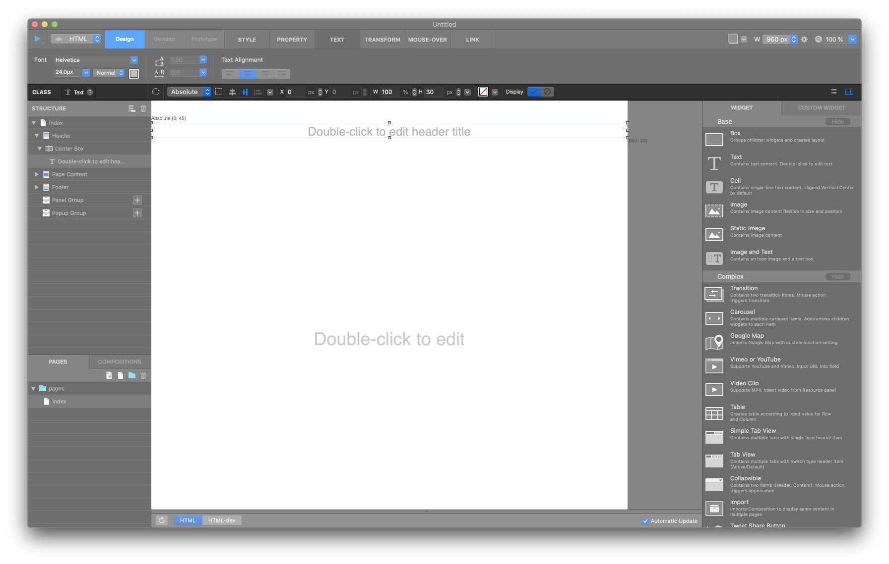

.. _Go To Widget Panel: ./basic_widget_panel.html
.. _페이지 캡쳐 : #Page Capture
.. _포지션 : #position
.. _프레임 : #frame
.. _정렬 : #align
.. _배경컬러 : #background-color
.. _위젯 보기 버튼 : #show-widget-button

중앙 툴바 Middle Toolbar
====================

중앙 툴바는 캔버스 바로 상단에 위치하며,  `페이지 캡쳐`_ / `포지션`_ / `프레임`_ / `배경컬러`_ / `위젯 보기 버튼`_ 영역으로 구분됩니다.

----------

페이지 캡쳐 Page Capture
-------------

현재 페이지를 캡쳐하여 **프로토타입 모드 Prototype Mode** 의 커스텀 섬네일에 추가합니다.

----------

포지션 Position
-------------

선택된 요소의 포지션을 설정합니다. (단위를 % 로 바꿀 경우, x/y 값은 드래그로 변경되지 않으며 w/h 값 역시 드래그로 변경되지 않습니다.)

* ``포지션 Position`` : 위젯의 포지션을 **Absolute, Relative, Fixed** 중 한 가지로 설정합니다.
* ``서브 포지션 Sub Position`` : 위젯의 포지션 기준을 무엇으로 할 지 서브 포지션을 설정합니다.
* ``정렬 버튼 Align Button`` : 위젯을 가운데로 맞춥니다. 여러위젯을 선택하여 정렬할 수 있습니다.
* ``포지션 속성 설정 팝업 Position setting popup`` : 요소의 포지션 가운데 고정 Fixed Center Position, 오버플로우 Overflow, z-index 속성을 변경할 수 있습니다.

* ``x 좌표 입력필드 & 스텝퍼 X position input field & Stepper`` : 요소의 x 좌표를 직접 입력하거나, 스텝퍼를 이용하여 1px 씩 조절합니다. px 또는 % 로 단위를 변경할 수 있습니다.
* ``y 좌표 입력필드 & 스텝퍼 Y position input field & Stepper`` : 요소의 y 좌표를 직접 입력하거나, 스텝퍼를 이용하여 1px 씩 조절합니다. px 또는 % 로 단위를 변경할 수 있습니다.

----------

프레임 Frame
----------

선택된 요소의 높이와 너비값을 설정합니다.

* ``Width 값 입력필드 & 스텝퍼 Width value input field & Stepper`` : 요소의 width 값을 직접 입력하거나, 스텝퍼를 이용하여 1px 씩 조절합니다. px 또는 % 로 단위를 변경할 수 있습니다.
* ``Height 값 입력필드 & 스텝퍼 Height value input field & Stepper`` : 요소의 height 값을 직접 입력하거나, 스텝퍼를 이용하여 1px 씩 조절합니다. px 또는 % 로 단위를 변경할 수 있습니다.
* ``최소/최대 크기 설정 팝업 Min/Max-width & Min/Max-height setting popup`` : 요소의 최소/최대 높이 또는 너비를 설정할 수 있습니다.

----------

배경컬러 Background Color
-----------------------

선택된 요소의 배경색을 선택하거나 투명값으로 설정할수 있습니다.

----------

위젯 보기 버튼 Show Widget Button
----------

버튼을 눌러 오른쪽에 위젯 패널을 보이게 하고 숨깁니다. 위젯 패널에는 아이유에디터에서 사용 가능한 모든 위젯들 보여집니다.  IU WIDGETS탭과 CUSTOM WIDGETS탭으로 나뉘어 있습니다.

`Go To Widget Panel`_
