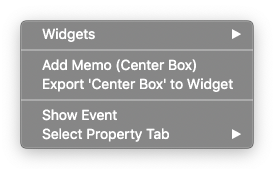
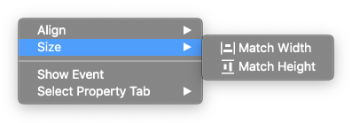

캔버스 Canvas
==============

.. thumbnail:: resource_new/canvas.png

캔버스는 아이유에디터에서 작업하는 화면을 말합니다. 위젯이나 섹션을 추가할 수 있으며, 수정한 내용이 바로바로 보여집니다.

----------

컨텍스트 메뉴 - 단일 위젯 Context Menu - Single Widget
-----------------------------------------------------------------

위젯을 선택한 상태이거나, 캔버스 상에서 우클릭을 하면, 컨텍스트 메뉴를 호출할 수 있습니다.

* ``위젯 Widget`` : 현재 마우스 포인터 위치에 있는 모든 위젯을 보여주어 선택을 손쉽게 할 수 있도록 도와줍니다.

.. image:: resource_new/single_widget_02.png

* ``메모 추가 Add Memo`` : 현재 선택된 위젯에 메모를 추가할 수 있는 :doc:`메모 패널<004_04_panel_memo>` 을 불러옵니다.
* ``위젯 내보내기 Export to Widget`` : 현재 선택된 위젯을 커스텀 위젯 Custom Widget 으로 만들 수 있는 :doc:`위젯 내보내기 패널<004_06_panel_export_widget>` 을 호출합니다.
* ``이벤트 보기 Show Event`` : 현재 선택된 위젯에 연결된 이벤트를 수정 / 추가 할 수 있는 :doc:`이벤트 패널<004_03_panel_event>` 을 불러옵니다.
* ``탭 선택  Select Tab`` : 원하는 :ref:`속성 탭<Tab_Menu>` 으로 바로 이동합니다.

----------

컨텍스트 메뉴 - 복수 위젯 Context Menu - Multiple Widget
--------------------------------------------------------------------------

.. image:: resource_new/multi_widget_01.png

복수의 위젯을 선택한 상태에서 우클릭을 하면, 컨텍스트 메뉴를 호출할 수 있습니다.

* ``정럴 Align`` : 현재 선택된 위젯들을 정렬하는 기능입니다. **좌측 정렬 Align Left, 중앙 정렬 Align Center, 우측 정렬 Align Right, 상단 정렬 Align Top, 세로 중앙 정렬 Align Middle, 하단 정렬 Align Bottom** 이 있습니다.

.. image:: resource_new/multi_widget_02.png

* ``크기 Size`` : 현재 선택된 위젯들의 크기를 맞추어 주는 기능입니다. **가로 맞춤 Match Width, 세로 맞춤 Match Height** 가 있습니다.

