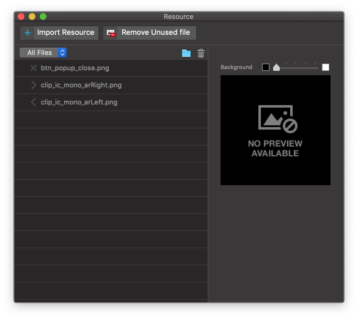

리소스 패널 Resource Panel
=========================

리소스 패널은 아이유에디터 메뉴 View > Resource 항목을 활성화 시키면 등장합니다. Image, Video 같은 사용자 리소스를 추가, 관리할 수 있습니다. 아이유에디터에서 제작 불가능한 이미지나 동영상 요소, 클립아트를 불러올 수 있는 패널입니다. 임포트 가능한 파일 종류는 **이미지파일, 동영상 파일, 자바스크립트, css, json** 이 있습니다.

.. note :: Supported Image File Types : gif, jpg, jpeg, png, ico, icns, svg, bmp

.. note :: Supported Video File Types : mp4, ogg, webm

* ``Import Resource Button`` : 파인더를 통해 외부리소스를 불러옵니다.
* ``Resource Type Select Button`` : 리소스 패널에 있는 파일을 **모두 보기 / 이미지 보기 / 동영상 보기** 로 필터링하여 줍니다.
* ``Add New Folder Button`` : 리소스 패널에 새로운 폴더를 생성합니다.
* ``Delete Button`` : 선택한 파일 또는 폴더를 삭제합니다.

리소스 관리 팁 Resource Management Tip
-----------------------------------

* 폴더를 생성하여 리소스를 관리 할 수 있습니다.
* 이미지 리소스를 이미지 위젯에 드래그 & 드롭하여 넣을 수 있습니다.
