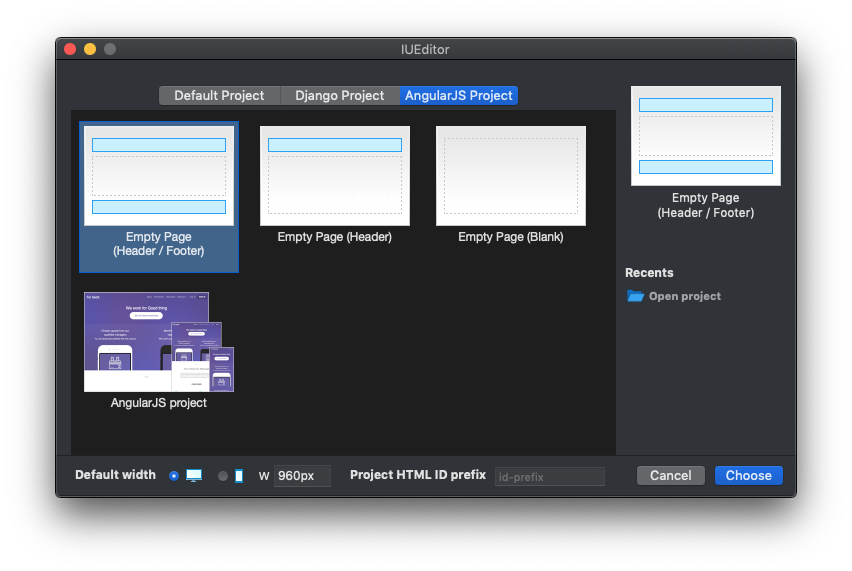

프로젝트 타입 Project Type
=======================

-------------

디폴트 프로젝트 Default Project
--------------------------

백엔드가 연결되지 않는 프로젝트 타입입니다. **파일 > 새 프로젝트** 를 실행하여 새 프로젝트 창을 열어 선택할 수 있습니다.

.. image:: resource/iu_manual_project_new_default.png

* ``Empty Page (Header / Footer)`` : 빈 레이아웃 (헤더 + 페이지 컨텐트 + 푸터)  프로젝트를 생성합니다.
* ``Empty Page (Header)`` : 빈 레이아웃 (헤더 + 페이지 컨텐트) 프로젝트를 생성합니다.
* ``Empty Page (Blank)`` : 빈 레이아웃 (페이지 컨텐트) 프로젝트를 생성합니다.

* ``IUPro`` : IUPro 템플릿 프로젝트를 생성합니다.
* ``Paper`` : IUPaper 템플릿 프로젝트를 생성합니다.
* ``IUAcademy`` : IUAcademy 템플릿 프로젝트를 생성합니다.

* ``Recent Project`` : 최근 사용했던 (최대 5개) 프로젝트 목록입니다.
* ``Open Project`` : 사용할 프로젝트를 직접 선택합니다.

.. note :: 빈 레이아웃 프로젝트를 선택 시, 새 프로젝트 창 하단에서 프로젝트의 기본 너비를 설정할 수 있습니다.

-------------

.. _Django_Project:

장고 프로젝트 Django Project
--------------------------

백엔드가 연결되는 프로젝트 타입입니다. **파일 > 새 프로젝트** 를 실행하여 새 프로젝트 창을 열어 선택할 수 있습니다.

사용가능한 메뉴는 디폴트 프로젝트와 동일합니다.

.. image:: resource/iu_manual_project_new_django.png

-------------

Angular JS프로젝트 Angular JS Project
-----------------------

백엔드가 연결되는 프로젝트 타입입니다. **파일 > 새 프로젝트** 를 실행하여 새 프로젝트 창을 열어 선택할 수 있습니다.

사용가능한 메뉴는 디폴트 프로젝트와 동일합니다.

