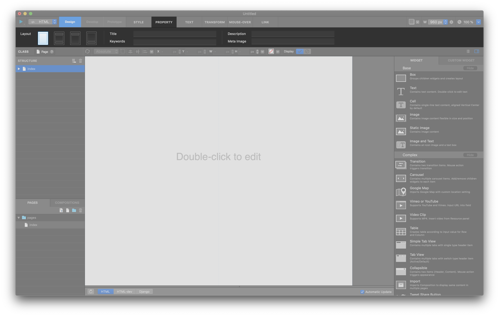
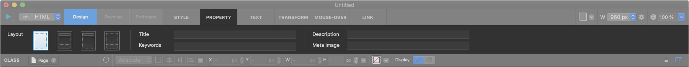
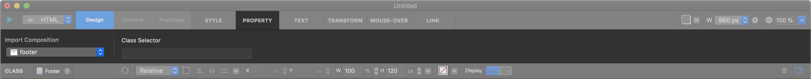
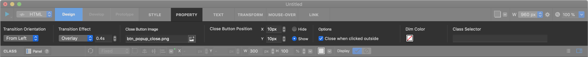
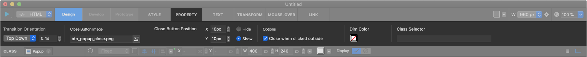

페이지 Page
============

-------------

페이지 세팅 Page Setting
-----------------------

페이지에는 직접적으로 위젯을 삽입할수 없습니다. 먼저 페이지 설정 버튼을 눌러 페이지 세팅 패널을 통해, 페이지의 레이아웃을 정한 후 각각 해당하는 곳에 위젯을 삽입합니다.

* **Empty Layout** : 빈 레이아웃 입니다.
* **Header + Footer** : 헤더 + 페이지 컨텐트 + 푸터로 구성되어 있습니다.
* **Header** : 헤더 + 페이지 컨텐트로 구성되어 있습니다.
* **Footer** : 페이지 컨텐트 + 푸터로 구성되어 있습니다.
* **페이지 타이틀 Page Title** : 현재 페이지의 타이틀을 입력합니다.
* **페이지 키워드 Page Keyword** : 현재 페이지의 키워드를 입력합니다. (**여러 키워드** 입력 가능)
* **페이지 설명 Page Description** : 현재 페이지의 페이지 설명을 입력합니다.
* **페이지 메타 이미지 Page Meta Image** : 현재 페이지의 메타 이미지 경로를 입력합니다. (**URL** 을 입력)

-------------

페이지 커스텀 코드 Page Custom Code
-----------------------

페이지 커스텀 코드 버튼을 눌러 페이지 커스텀 코드 패널을 불러올 수 있습니다.

.. image:: resource_new/sheet_page_code.png

* **Page Header Custom Code** : 페이지 헤더 Header 부분에 추가할 커스텀 코드를 입력합니다.
* **Page Header Custom Code for Backend** : 페이지 헤더 Header 부분에 추가할 백엔드 커스텀 코드를 입력합니다.

-------------

페이지 기본 위젯 Page Default Widget
----------------------------

**Page**

페이지는 html 문서와 동일하며, 속성 탭에서 페이지 구조를 변경할 수 있습니다.

**헤더 Header**

페이지의 상단에 위치하는 영역입니다. 헤더영역에는 헤더 컴포지션이나 다른 컴포지션을 임포트 할 수 있습니다.

**페이지컨텐트 Page Content**

페이지의 본문 컨텐츠 영역입니다. 페이지 컨텐트 요소는 삭제 불가능하며, 하위요소로 섹션을 추가할 수 있습니다.

**푸터 Footer**

페이지의 하단에 위치하는 영역입니다. 푸터영역에는 푸터 컴포지션이나 다른 컴포지션을 임포트 할 수 있습니다.

**섹션 Section**

페이지컨텐트의 하위 요소인 섹션입니다. 섹션에는 위젯을 자유롭게 추가할 수 있습니다.

.. image:: resource/widget/IUCenterBox.png
**센터박스 Centered Box**

섹션이 생성되면 자동으로 추가되는 위젯요소입니다. 페이지의 요소를 가운데로 정렬시키기 위해 사용됩니다. 사이즈나 위치조절이 불가능하며, 너비는 작업중인 미디어쿼리 사이즈를 따라갑니다. 가운데 정렬이 불필요할때는 삭제해도 무관합니다.

**패널 Panel**

패널 그룹의 [+] 버튼을 눌러 패널을 추가합니다. 패널을 호출하려면 위젯과 링크를 생성하고 패널에 대한 링크 대상을 선택해야합니다.

**팝업 Popup**

팝업 그룹의 [+] 버튼을 눌러 팝업을 추가합니다. 팝업을 호출하려면 위젯과 링크를 생성하고 팝업에 대한 링크 대상을 선택해야합니다.
