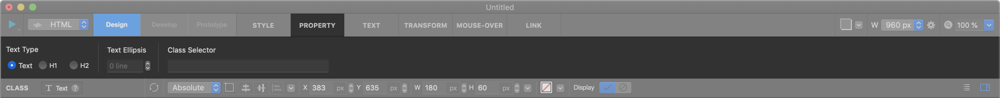
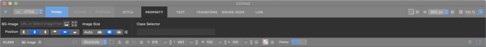
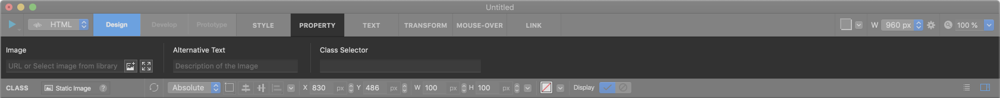
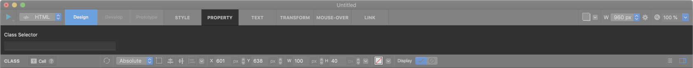
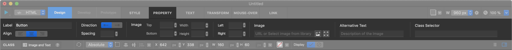

기본 위젯 Basic Widget
============

-----------

.. image:: resource/widget/IUBox.png

박스 Box
----------

가장 기본적인 위젯이며 
 태그로 생성됩니다.
주로 레이아웃을 설정하는데에 사용되며 하위요소를 묶어주는 그룹 용도로도 사용됩니다.

**속성**

* 하위요소 : 가능
* 링크 : 가능
* 스크롤 애니메이터 : 가능
* 배경이미지 : 가능
* 백엔드 엘립시스 : 불가능

.. raw:: html

    

       <iframe width="560" height="315" src="https://www.youtube.com/embed/_D5d3eKYFMw" frameborder="0" allowfullscreen></iframe>
    

----------

텍스트 Text
----------

텍스트 위젯입니다.

 태그로 생성되며 Text 탭에서 <h1> 혹은 <h2> 태그로 변경할 수 있습니다.
텍스트 위젯을 생성하고 더블클릭하면 텍스트를 입력할 수 있으며, 그 상태에서 한번 더 더블클릭하면 부분편집모드로 변경됩니다.

**속성**

* 하위요소 : 불가능
* 링크 : 가능
* 스크롤 애니메이터 : 가능
* 배경이미지 : 가능
* 백엔드 엘립시스 : 가능

.. raw:: html

    

        <iframe width="560" height="315" src="https://www.youtube.com/embed/zhllW9hdtm4" frameborder="0" allowfullscreen></iframe>
    

----------

.. image:: resource/widget/IUFloatingImage.png

이미지 Image
----------

이미지 위젯입니다.
라이브러리에 추가한 이미지를 선택하거나, 이미지 URL을 직접 입력해 불러올수 있습니다.
Fit widget size to image size 버튼을 누르면 불러온 이미지 사이즈에 맞춰 위젯 사이즈가 자동으로 변경됩니다.
위젯영역 내에서 이미지의 사이즈와 정렬상태을 변경할 수 있습니다.

**속성**

* 하위요소 : 불가능
* 링크 : 가능
* 스크롤 애니메이터 : 가능
* 배경이미지 : 불가능
* 백엔드 엘립시스 : 불가능

----------

.. image:: resource/widget/IUImage.png

스태틱 이미지 Static Image
------------------------

스태틱 이미지 위젯입니다.
라이브러리에 추가한 이미지를 선택하거나, 이미지 URL을 직접 입력해 불러올수 있습니다.
Fit widget size to image size 버튼을 누르면 불러온 이미지 사이즈에 맞춰 위젯 사이즈가 자동으로 변경됩니다.

**속성**

* 하위요소 : 불가능
* 링크 : 가능
* 스크롤 애니메이터 : 가능
* 배경이미지 : 가능
* 백엔드 엘립시스 : 가능

.. raw:: html

    

        <iframe width="560" height="315" src="https://www.youtube.com/embed/RHax9vtH91I" frameborder="0" allowfullscreen></iframe>
    

-------------

셀 Cell
----------

텍스트가 자동으로 중앙정렬 되어 있는 위젯입니다. 위젯의 높이 H 는 픽셀 px 단위만 사용할 수 있습니다.

**속성**

* 하위요소 : 불가능
* 링크 : 가능
* 스크롤 애니메이터 : 가능
* 배경이미지 : 가능
* 백엔드 엘립시스 : 가능

.. raw:: html

    

       <iframe width="560" height="315" src="https://www.youtube.com/embed/l4XBFTpfmSM" frameborder="0" allowfullscreen></iframe>
    

----------

아이콘 버튼 Icon Button
----------------------

셀 위젯에 이미지를 추가할 수 있는 아이콘 버튼 위젯입니다. 이미지와 텍스트가 자동으로 중앙정렬 되고, 이미지의 크기, 위치 좌우배치 등을 변경할 수 있습니다.

**속성**

* 하위요소 : 불가능
* 링크 : 가능
* 스크롤 애니메이터 : 가능
* 배경이미지 : 가능
* 백엔드 엘립시스 : 가능

----------
