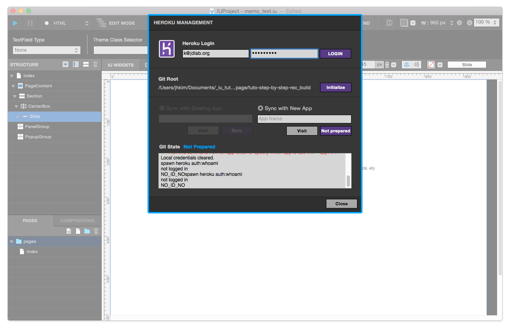

.. _헤로쿠 튜토리얼 참고 : http://tutorial.iueditor.org/tuto02-magazine-part3.html

헤로쿠 Heroku
============

프로젝트 화면에서, ⇧⌘H 키를 누르면 위와 같은 헤로쿠 관리 창이 뜹니다. 헤로쿠 관리 패널에서는 유저 개개인의 계정으로 접속하여, 아이유에디터에서 헤로쿠 서버로 업로드를 할 수 있어, 아이유에디터로 만든 웹사이트를 서버에서 바로 볼 수 있는 매우 편리한 기능입니다.

`헤로쿠 튜토리얼 참고`_

