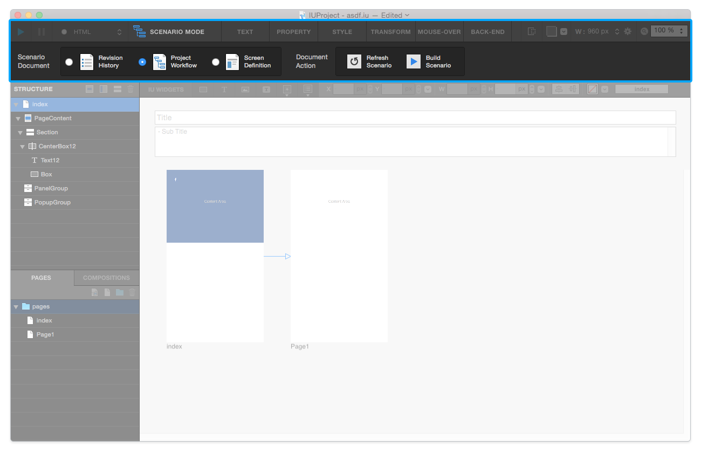

시나리오 모드 Scenario Mode
=======================

상단 툴바에서 ``시나리오 / 에디트 모드 변경 버튼`` 을 클릭하면 시나리오 모드로 진입합니다. 

**수정 이력 Revision History / 프로젝트 워크플로우 Project Workflow / 화면 정의 Screen Definition** 페이지로 구분되며, 우측의 ``도큐먼트 빌드 Document Build`` 버튼을 실행하여 **HTML 시나리오 문서** 를 제작할 수 있습니다.

----------

개정 이력 Revision History
-----------------------

현재 프로젝트에 대한 개정 이력을 작성 / 수정합니다.

----------

프로젝트 워크플로우 Project Workflow
-------------------------------

현재 프로젝트내 각 페이지 사이에 걸린 링크들의 경로를 보여줍니다.

----------

화면 정의 Screen Definition
-------------------------------

.. image:: resource/scenario/ic_SB_screen.png

페이지 스트럭쳐에서 선택된 페이지의 상세 화면 정의를 작성할 수 있습니다. 

