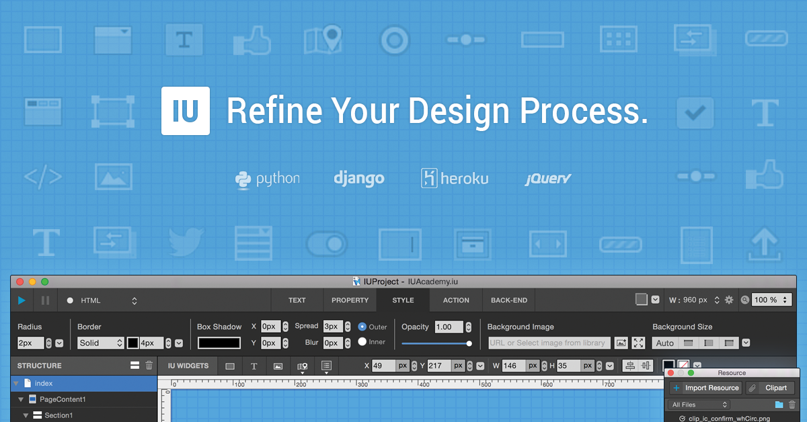

===============
IUEditor Manual
===============

환영합니다! **아이유에디터** 공식 메뉴얼입니다.

* 한글 매뉴얼 PDF 다운받기 : http://iueditor.org/static/IUEditorManualKo.pdf

프로그램은 아래 홈페이지에서 다운받아 주세요.

* IUEditor Homepage : http://iueditor.org
* IUEditor Facebook Page (Korean): https://www.facebook.com/iueditor

---------

.. toctree::
   :maxdepth: 2
   :caption: 소개 Introduction

   intro_what_is_iueditor
   intro_environment

.. toctree::
   :maxdepth: 2
   :caption: 기본 기능 Basic Feature

   basic_menu
   basic_top_toolbar
   basic_middle_toolbar
   basic_widget_panel
   basic_navigation
   basic_canvas

.. toctree::
   :maxdepth: 2
   :caption: 고급 기능 Advanced Feature

   advanced_developer_mode
   advanced_prototype_mode

.. toctree::
   :maxdepth: 2
   :caption: 패널 Panel

   project_setting
   panel_resource
   panel_event
   panel_memo
   panel_management_widget
   panel_export_widget

.. toctree::
   :maxdepth: 2
   :caption: 프로젝트 타입 Project Type

   project_type

.. toctree::
   :maxdepth: 2
   :caption: 시트 Sheet

   sheet_page
   sheet_composition

.. toctree::
   :maxdepth: 2
   :caption: 위젯 Widget

   widget_basic
   widget_complex
   widget_programming
   widget_wordpress

.. toctree::
   :maxdepth: 2
   :caption: 알려진 버그 Known Bugs

   known_bug_list

.. toctree::
   :maxdepth: 2
   :caption: 환경설정 Preference

   preference
   preference_custom_template

.. toctree::
   :maxdepth: 2
   :caption: 부록 Appendix

   appendix_templates
   appendix_shortcut
   appendix_dict
   tutorial
