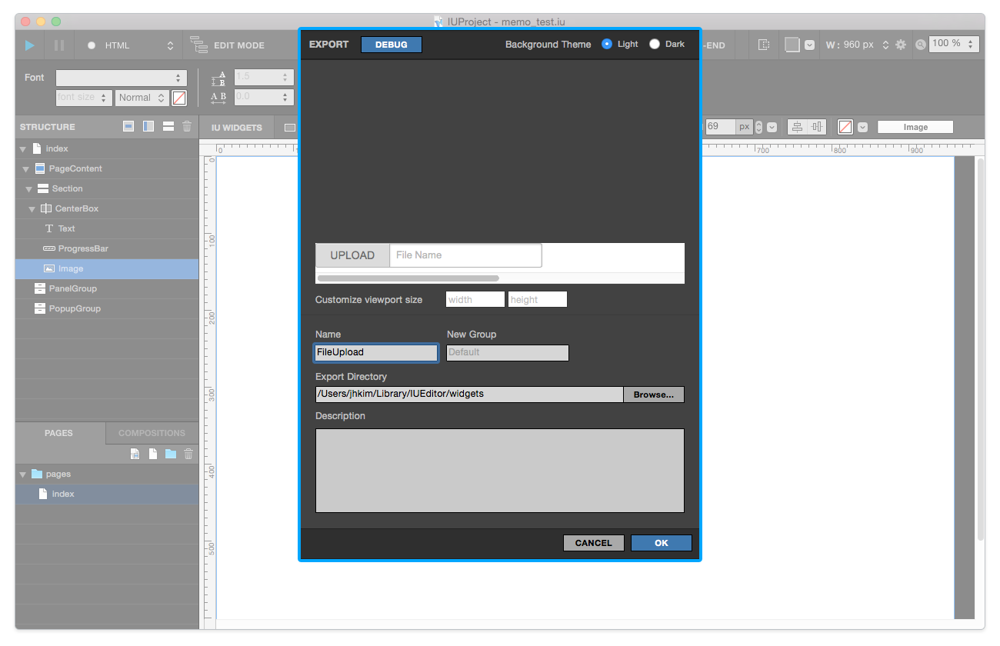
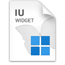
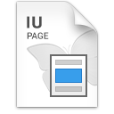
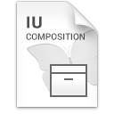

.. _위젯 가져오기 패널 : ./panel_import_widget.html
.. _네비게이션 > 페이지 탭 : ./basic_navigation.html#pages
.. _네비게이션 > 컴포지션 탭 : ./basic_navigation.html#compositions

위젯 내보내기 패널 Export Widget Panel
==============================

위젯 내보내기 패널은

* 스트럭쳐나 캔버스에서 특정 위젯을 선택하여 컨텍스트 메뉴 > 위젯 내보내기 Export Widget 실행
* 페이지를 선택하여 컨택스트 메뉴 > 페이지 내보내기 Export Page 실행
* 컴포지션을 선택하여 컨텍스트 메뉴 > 컴포지션 내보내기 Export Composition 실행

하여 불러올 수 있습니다. 

----------

위젯 내보내기 Export Widget (.iuw)
-----------------------------

위 1) 상황에서 내보내기 Export 기능을 실행 하면, 로컬디스크에는 ``커스텀위젯이름.iuw`` 파일이 생성됩니다. 이 파일은 `위젯 가져오기 패널`_ 에서 불러온 후에 사용 가능합니다.

----------

페이지 내보내기 Export Page (.iup)
-----------------------------

위 2) 상황에서 내보내기 Export 기능을 실행 하면, 로컬디스크에는 ``커스텀페이지이름.iup`` 파일이 생성됩니다. 이 파일은 `네비게이션 > 페이지 탭`_ 에서 ``커스텀 페이지 추가 버튼`` 으로 불러올 수 있습니다.

----------

컴포지션 내보내기 Export Page (.iuc)
-----------------------------

위 3) 상황에서 내보내기 Export 기능을 실행 하면, 로컬디스크에는 ``커스텀위젯이름.iuc`` 파일이 생성됩니다. 이 파일은 `네비게이션 > 컴포지션 탭`_ 에서 ``커스텀 컴포지션 추가 버튼`` 으로 불러올 수 있습니다.