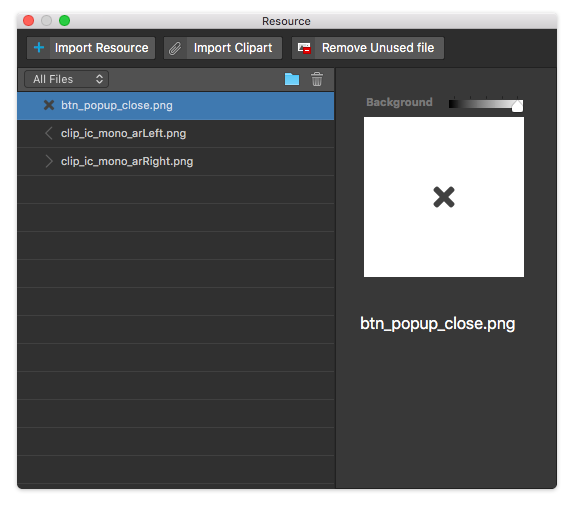

.. _임포트 클립아트 Import Clipart : #import-clipart

리소스 패널 Resource Panel
=======================

리소스 패널은 아이유에디터 메뉴 View > Resource 항목을 활성화 시키면 등장합니다. Image, Video 같은 사용자 리소스를 추가, 관리할 수 있습니다. 아이유에디터에서 제작 불가능한 이미지나 동영상 요소, 클립아트를 불러올 수 있는 패널입니다. 임포트 가능한 파일 종류는 **이미지파일( jpg / png / gif / svg), 동영상 파일(mp4)** 이 있습니다.

* ``Import Resource Button`` : 파인더를 통해 외부리소스를 불러옵니다.
* ``Import Clipart Button`` : `임포트 클립아트 Import Clipart`_ 화면을 통해 아이유에디터에서 제공하는 클립아트를 불러옵니다.
* ``Resource Type Select Button`` : 리소스 패널에 있는 파일을 **모두 보기 / 이미지 보기 / 동영상 보기** 로 필터링하여 줍니다.
* ``Add New Folder Button`` : 리소스 패널에 새로운 폴더를 생성합니다.
* ``Delete Button`` : 선택한 파일 또는 폴더를 삭제합니다.

----------

클립아트 불러오기 Import Clipart 
---------------------------

아이유에디터에서 제공하는 클립아트를 불러올 수 있습니다.

.. image:: resource/iu_manual_panel_resource_clipart.png

* ``Import`` : 선택한 클립아트를 리소스 패널에 추가합니다.
* ``Cancel`` : 클립아트를 추가하지 않고 현재 창을 닫습니다.
* ``Grid / List View Change Button`` : 리스트 뷰 / 그리드 뷰 를 변경할 수 있는 토글 버튼입니다.
* ``Clipart Type Select Button`` : 클립아트 파일을 **모두 보기 / 아이콘** 등으로 필터링하여 줍니다.
* ``Search`` : 클립아트 이름을 기준으로 검색할 수 있습니다.

----------

리소스 관리 Resource Management
----------------------------

파일 타입(이미지/동영상)을 지정해서 리소스를 볼 수 있습니다.

1. 리소스 그룹을 추가합니다.
2. 선택된 리소스를 프로젝트에서 삭제합니다.
3. 리소스 그룹을 만든 후에 마우스 드래그&드랍을 이용하여 리소스를 그룹별로 관리할 수 있습니다.