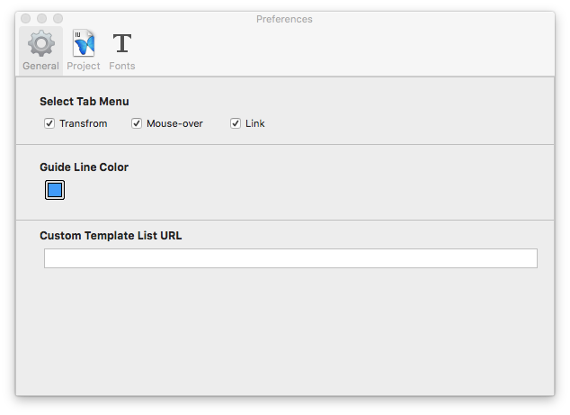
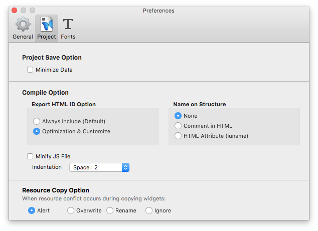
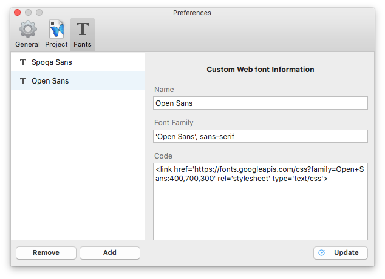

.. _커스텀 위젯 Custom widget : ./panel_management_widget.html

환경설정 Preference
=======================

IUEditor의 사용환경을 설정합니다. 

-------------

일반 General
--------------------------

* ``탭 메뉴 Select Tab Menu`` : 탭메뉴를 상단 툴바에서 보이도록 할 지 선택합니다.
* ``가이드 라인 색 Guide Line Color`` : 가이드라인 색상을 변경합니다. (가이드라인 보기 : View > Guide ⌘;)

-------------

프로젝트 Project
--------------------------

* ``세이브 옵션 Project Save Option`` : Minimize Data 체크시 프로젝트의 json파일을 압축합니다. 
* ``컴파일 옵션 Compile Option`` : 
   *- ``Export HTML ID Option`` : HTML ID를 모든 위젯에 기본으로 생성되도록 할 것인지, 선택된 위젯만 HTML ID를 만들 것인지 선택합니다.
   *- ``Name on Structure`` : HTML문서에 위젯 이름을 포함할 것인지 선택합니다. 

* ``Resource Copy Option`` : ``커스텀 위젯 Custom Widget``_ 을 캔버스에 추가할 때 중복되는 리소스를 어떻게 처리할 지 선택합니다.
* ``Widget Option`` : 섹션을 추가할 때 센터박스를 기본으로 포함되도록 할 것인지 선택합니다.

-------------

폰트 Fonts
--------------------------

폰트 리스트에 새 웹폰트를 추가합니다. 

