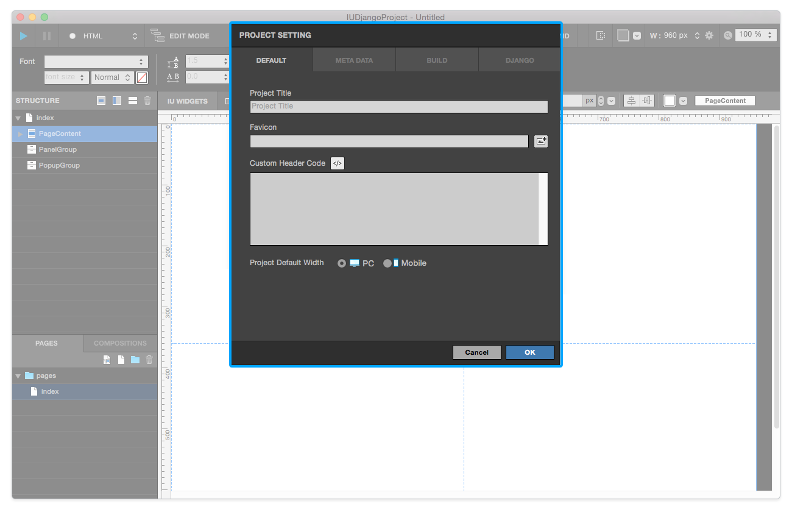
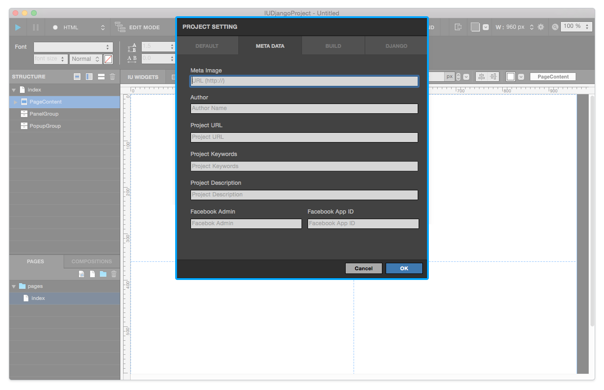
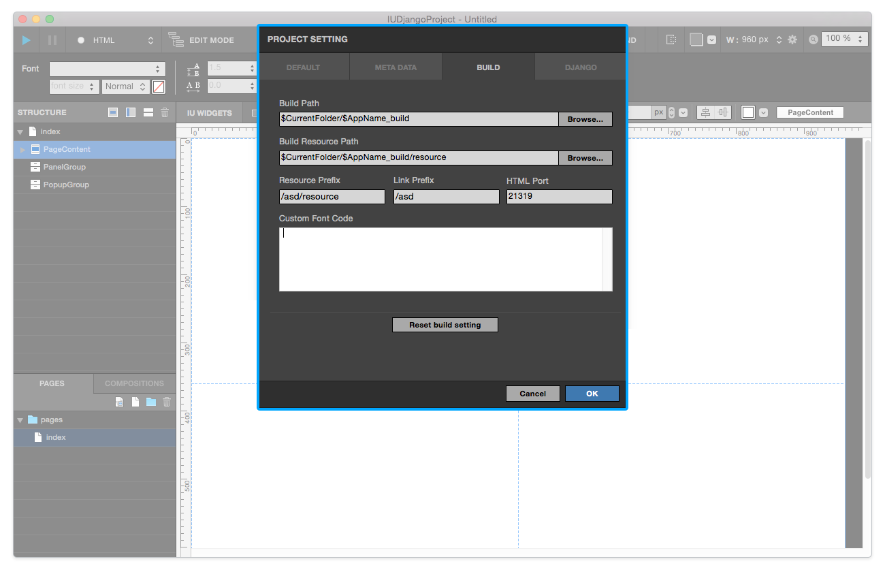
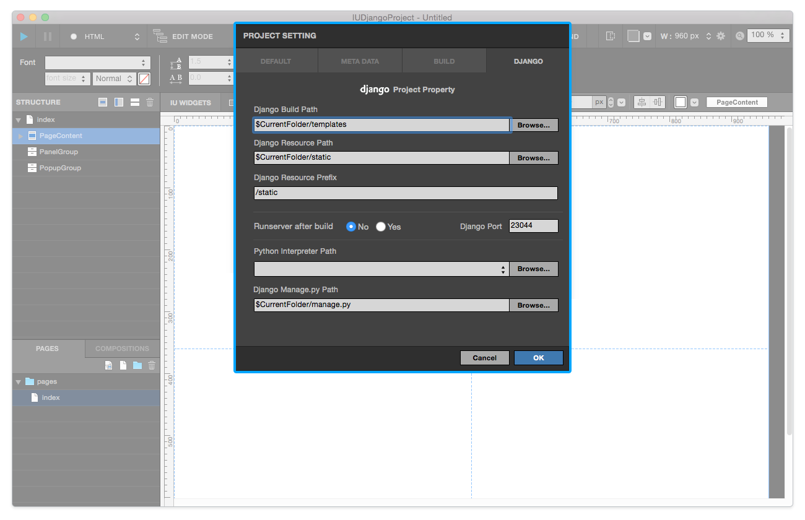

.. _디폴트 Default : #id2
.. _메타 Meta : #id3
.. _빌드 Build : #id4
.. _장고 Django : #id5
.. _장고 프로젝트 : ./project_type.html#django-project

프로젝트 셋팅 Project Setting
=======================

**프로젝트 > 프로젝트 셋팅** 메뉴를 실행하거나 **⇧⌘P** 키를 실행하면 프로젝트 셋팅 패널이 보여집니다. `디폴트 Default`_ , `메타 Meta`_ , `빌드 Build`_ , `장고 Django`_ 탭 메뉴를 눌러 각 항목의 내용을 추가하거나 수정할 수 있습니다.

----------

디폴트 Default
------------

* ``Project Title`` : 브라우져에서 보여질 프로젝트의 타이틀을 입력합니다.
* ``Favicon`` : 파비콘 이미지를 설정합니다. 리소스로 불러들여온 후에 사용이 가능합니다.
* ``Custom Header Code`` : 프로젝트 내 모든 페이지에 공통으로 적용될 커스텀 코드를 입력합니다.

.. note :: Project Default Width 는 프로젝트 생성 이후에는 변경이 불가능합니다.

-------------

메타 Meta
------------

* ``Meta Image`` : 메타이미지를 설정합니다. 외부경로 (URL)만 입력 가능합니다.
* ``Author`` : 메타데이타에 포함될 제작자의 이름을 입력합니다.
* ``Project URL`` : 메타데이타에 포함될 프로젝트의 URL 경로를 입력합니다.
* ``Project Keywords`` : 메타데이타에 포함될 프로젝트의 키워드를 입력합니다. (복수 입력 가능 / 엔터나 콤마로 구분)
* ``Project Description`` : 메타데이타에 포함될 프로젝트 설명을 입력합니다.
* ``Facebook Admin`` : 메타데이타에 포함될 페이스북 어드민 아이디를 입력합니다.
* ``Facebook App ID`` : 메타데이타에 포함될 페이스북 앱 아이디를 입력합니다.

------------

빌드 Build
------------

* ``Build Path`` : 빌드 실행 시 생성되는 폴더의 경로를 설정합니다.
* ``Build Resource Path`` : 빌드 실행 시 생성되는 리소스 폴더의 경로를 설정합니다.
* ``Resource Prefix`` : 프로젝트가 사용할 리소스 폴더의 경로를 설정합니다. 
* ``Link Prefix`` : 프로젝트가 사용할 링크의 경로를 설정합니다.
* ``HTML Port`` : 프로젝트가 사용할 로컬호스트 서버의 포트를 설정합니다.

.. note :: 프로젝트가 사용하는 주소가 루트 패스 root path 가 아닐 경우, 리소스 프리픽스와 링크 프리픽스 경로를 수정해야 합니다.

------------

장고 Django
------------

.. note :: 장고 셋팅은 `장고 프로젝트`_ 에서만 설정 가능합니다.

* ``Django Build Path`` : 빌드 실행 시 생성되는 장고 폴더의 경로를 설정합니다.
* ``Django Resource Path`` : 빌드 실행 시 생성되는 장고 리소스 폴더의 경로를 설정합니다.
* ``Django Resource Prefix`` : 장고 프로젝트가 사용할 리소스 폴더의 경로를 설정합니다.
* ``Runserver after build`` : 빌드 실행 이후에 로컬호스트 서버 실행 여부를 설정합니다.
* ``Django Port`` : 장고 프로젝트가 사용할 로컬호스트 서버의 포트를 설정합니다.
* ``Python Interpreter Path`` : 장고 프로젝트가 사용하는 파이썬 인터프리터의 경로를 설정합니다.
* ``Django Manage.py Path`` : 장고 프로젝트가 사용하는 Manage.py 파일의 경로를 설정합니다.
